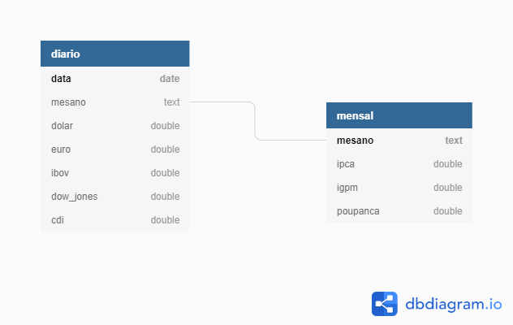

# Web Scraping and Databases
This project aims to search historical series of financial indicators and save them in a database.

## Sources
* Api from BCB <https://olinda.bcb.gov.br/olinda/servico/PTAX/versao/v1/documentacao#CotacaoDolarDia>
* Api from Alphavantage <https://www.alphavantage.co/documentation/>
* Tables from site <https://www.ecalculos.com.br/utilitarios>

## Indexes

### Daily
* Dólar
* Euro
* Ibov
* Dow Jones
* CDI

### Monthly
* IPCA
* IGPM
* Poupança

## DB

PostgreSQL

* Diagram
